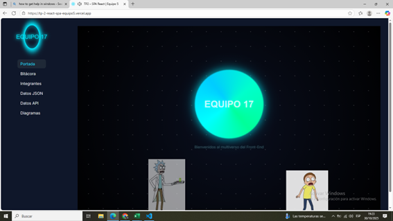
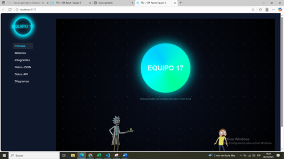
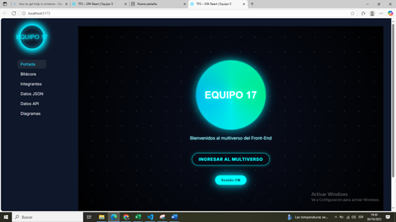
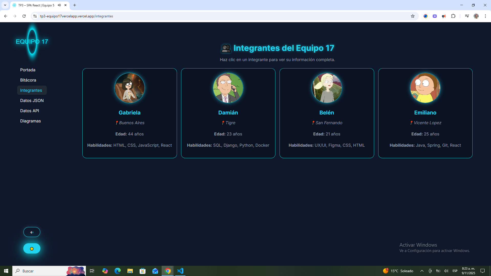
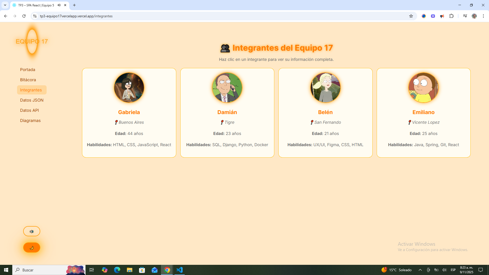
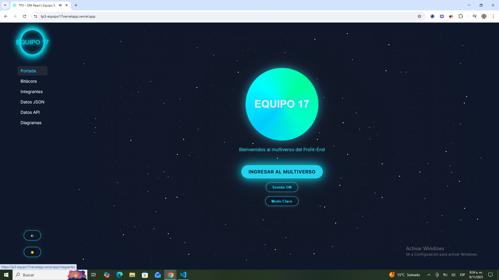
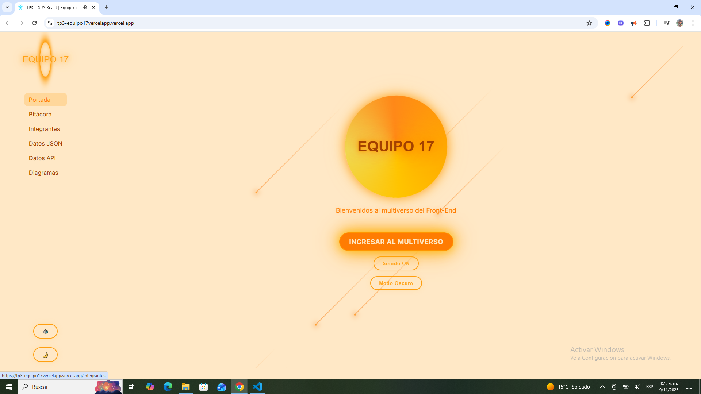

# 🌌 TP3 – React SPA Equipo 17

## 🚀 Descripción del Proyecto
Este trabajo corresponde al **TP3 de Front-End** del **Equipo 17**.  
El proyecto es una **Single Page Application (SPA)** desarrollada con **React**, basada en la evolución del TP2.  
En esta entrega se aplicaron **mejoras visuales y funcionales** sobre la estructura previa, manteniendo la navegación interna y los componentes reutilizables.

---

## 👩‍💻 Integrantes del Equipo
- Gabriela Aguilera  
- Emiliano Nuñez  
- Damián Gómez de Leo  
- María Belén Cantarini Echezarreta  

---

## 🧠 Objetivo del TP3
Implementar **dos mejoras significativas** respecto al TP2, priorizando la estética, la interactividad y la experiencia del usuario, utilizando React y CSS.

---

## ✨ Mejoras Realizadas por Gabriela Aguilera

### 🔹 Mejora 1 – Portada Animada Rick & Morty
Se rediseñó por completo la pantalla inicial del sitio para transformarla en una **portada interactiva y temática**, inspirada en el universo de *Rick & Morty*.  
Se agregaron animaciones CSS, fondo galáctico con estrellas en movimiento, un portal dinámico con efectos de luz y entrada animada de los personajes.

#### 🖼️ Comparativa visual
| Antes | Después |
|:--:|:--:|
|  |  |

**Detalles técnicos:**
- Portal animado con degradado cónico (`conic-gradient`).
- Fondo animado mediante `@keyframes moveStars`.
- Personajes (Rick y Morty) con animación de desplazamiento lateral.
- Efecto de destello sincronizado en el portal.
- Diseño totalmente responsive.

---

### 🔹 Mejora 2 – Botón de Sonido ON/OFF
Se incorporó un **control de sonido interactivo** que permite activar o silenciar la música desde la portada.  
El sonido se reproduce automáticamente al ingresar y puede controlarse con un solo clic.

#### 🖼️ Captura del botón de sonido

**Detalles técnicos:**
- Implementación mediante `useRef` y `useState` para controlar el audio.
- Archivo `portal-sfx.mp3` ubicado en `/public`.
- Estilo visual coherente con el diseño del portal (borde luminoso y animación hover).
- Volumen ajustado al 40% para una experiencia más suave.

---
## ✨ Mejoras Realizadas por Damian Gomez De Leo

### 🔹 Mejora 3 – Control de Tema Global y Persistencia
Se implementó el Modo Claro / Oscuro mediante la arquitectura de estado global de React, permitiendo al usuario personalizar la interfaz de la aplicación de manera persistente.

Se mejoró el botón de retorno a la vista de integrantes, agregando un efecto de entrada y glow para integrarlo visualmente con el estilo multiverso del sitio.
| Modo Oscuro | Modo Claro |
|:--:|:--:|
|  |  |

**Detalles técnicos:**
- **Estado Global (React Context):** Se utilizó la arquitectura de React Context `createContext` y `useContext` para centralizar el estado del tema (light o dark), haciendo que la preferencia sea accesible de forma directa por cualquier componente en la jerarquía (evitando el prop drilling).
- **Persistencia (`localStorage`):** Se integró el *Hook* `useEffect` para:
    1.  Recuperar el último tema guardado desde `localStorage` al montar el componente.
    2.  Guardar el nuevo tema en `localStorage.setItem('theme', nuevoTema)`.
---

## ✨ Mejoras Realizadas por Maria Belen Cantarini Echezarreta

### 🔹 Mejora 4 – Navegador Lateral Funcional y Fondos Temáticos Dinámicos (María Belén Cantarini Echezarreta)

Se optimizó la usabilidad del sitio a través del rediseño del navegador lateral y se incrementó el dinamismo visual mediante fondos reactivos al tema.

#### 🖼️ Comparativa visual
| Estrellas | Meteoros |
|:--:|:--:|
|  |  |

**Detalles técnicos:**

* **Navegación Intuitiva:** Se implementaron botones dentro del *Sidebar* para los nuevos controles de **Sonido y Tema** y que estos se muestren consistentemente..
* **Fondos Reactivos:** Se crearon estilos de fondo animados y contrastantes, controlados por el **Theme Context** global:
    * **Modo Oscuro:** Uso de fondos con animaciones de **estrellas** para una inmersión nocturna.
    * **Modo Claro:** Uso de fondos con animaciones de **lluvia de meteoros** para su versión diurna. 
* **Modularización:** El componente de fondo se diseñó para inyectarse dinámicamente y reaccionar instantáneamente al cambio de estado del tema.

---

## ✨ Mejoras Realizadas por Emiliano Nuñez

### 🔹 Mejora 5  – Animación de Entrada en Vista Individual de Integrantes (Emiliano Nuñez)

Se implementó una animación escalonada para la vista individual de cada integrante, mejorando la experiencia visual al abrir su perfil.
La entrada incluye efectos de fade y desplazamiento para el avatar, nombre, ciudad y secciones de contenido, generando una transición suave y coherente con el estilo del sitio.

**Detalles técnicos:**
- Animación @keyframes fadelInItem aplicada con animation-delay escalonado.
- Clases CSS específicas para cada elemento (perfil-avatar, perfil-nombre, etc.).
- Integración directa en Integrante.jsx y Integrante.css .
- Mejora visual sin afectar el rendimiento ni la estructura del componente.

---

### 🔹 Mejora 6  – Botón de retorno con efecto visual (Emiliano Nuñez)

Se mejoró el botón de retorno a la vista de integrantes, agregando un efecto de entrada y glow para integrarlo visualmente con el estilo multiverso del sitio.

#### 🖼️ Comparativa visual
 

**Detalles técnicos:**
- Animación aplicada con animation-delay.
- Efecto de glow mediante  box-sahdow y transición suave.
- Clase personalizada para el botón (back ) aplicada en Integrante.jsx .

---

## 🧩 Estructura de Componentes

src/
├─ components/
│ ├─ Sidebar/
│ ├─ HamburguerButton/
│ └─ Cards/
├─ pages/
│ ├─ Portada.jsx
│ ├─ DataLocal.jsx
│ ├─ DataAPI.jsx
│ ├─ Integrantes.jsx
│ ├─ Diagramas.jsx
│ └─ Bitacora.jsx
├─ data/
│ └─ items.json
├─ App.jsx
└─ main.jsx

---

## 🧰 Tecnologías Utilizadas
- React 18  
- React Router DOM  
- CSS3 (animaciones, responsive y efectos visuales)  
- HTML5  
- Archivos JSON locales y API pública (Rick & Morty)  

---

## 🖼️ Vista General del Proyecto

---

## 🌐 Deploy en Vercel
🔗 [Ver proyecto en línea](https://tp3-equipo17vercelapp.vercel.app/)

---

## 🏁 Conclusión
Las mejoras implementadas logran un sitio **más atractivo, moderno y dinámico**, destacando la creatividad visual, la correcta modularización y el control de elementos multimedia dentro de React.
